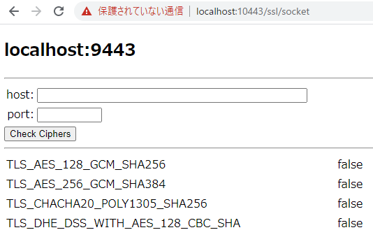

# MustGather Hands-On SSL case

## Start db-connections container on docker or openshift

Follow steps described at parent folder's README 

## Access to the servlet to test db operation select/insert/update/dalete

Access to following URL by your browser

- http://localhost:10443/ssl/

![httpsclient]:(httpsclient.png)

You can set host, port and trust manager to access from liberty by https.
You can check that behavior with websphere trace.

## Create scripts to access database by multithreads

Access to following URL by your browser

- https://localhost:10443/ssl/socket

Please use Check Ciphers button to get ciphers list of specified host and port.

## Check trace

Please check /logs/trace.log to investigate ssl behavior
